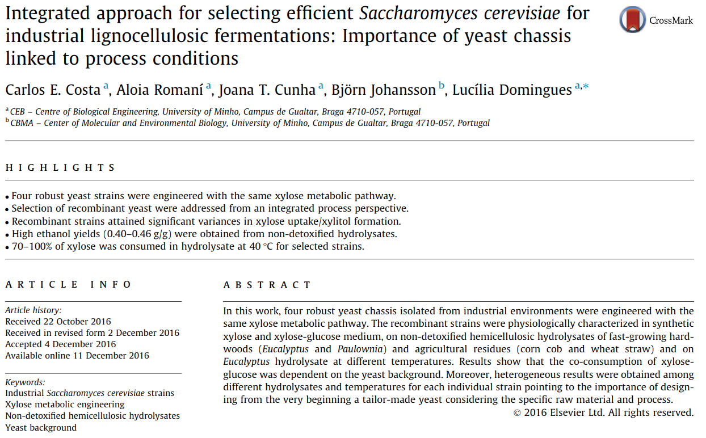

# [Cunha et al. 2017](https://www.ncbi.nlm.nih.gov/pubmed/28013133)

This repository contains Jupyter notebooks describing metabolic pathways for Saccharomyces cerevisiae
using [python](https://www.python.org/) and [pydna](https://github.com/BjornFJohansson/pydna).

These notebooks and other files accompany the publication:

[Costa, C.E., Romaní, A., Cunha, J.T., Johansson, B., Domingues, L., 2017. Integrated approach for selecting efficient Saccharomyces cerevisiae for industrial lignocellulosic fermentations: Importance of yeast chassis linked to process conditions. Bioresour. Technol. 227, 24–34.](https://www.ncbi.nlm.nih.gov/pubmed/28013133)

These notebooks can be visualized in a number of ways.
Each notebook is accompanied by a HTML file with the same name that is a static
version that can be opened in a browser without installing any software.

The notebooks are the files ending in `.ipynb`. These can be opened in the browser through the nbviewer service
[here](http://nbviewer.jupyter.org/github/MetabolicEngineeringGroupCBMA/Cunha_et_al_2017/blob/master/notebooks/index.ipynb)
or directly in Github [here](notebooks/index.ipynb).

[index](notebooks/index.ipynb)

[pMEC1049](notebooks/pMEC1049.ipynb)

[pMEC9001-2-3](notebooks/pMEC9001-2-3.ipynb)

The index.ipynb notebook has links to the other notebooks and is the place to start.

Each notebook contain links (usually in the end) to the resulting sequences in Genbank flat file format.

These notebooks are tested on the github action build service.

This means that the notebook outputs are reexecuted and compared with saved results.
If the badge below is green, all tests gave the expected results.

If you would like to have your own copy of this repository, the best solution is to get a
Github account and then make your own fork. If you would like to download all files to your
computer as a zip file, Click [here](https://github.com/BjornFJohansson/Cunha_et_al_2017/archive/master.zip)

Executing these notebooks require [pydna](https://github.com/BjornFJohansson/pydna) (version 3.1.1 or later)
and [pygenome](https://github.com/BjornFJohansson/pygenome) 3.1.0. or later.
