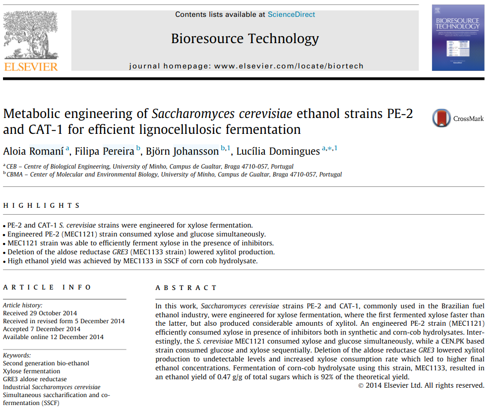
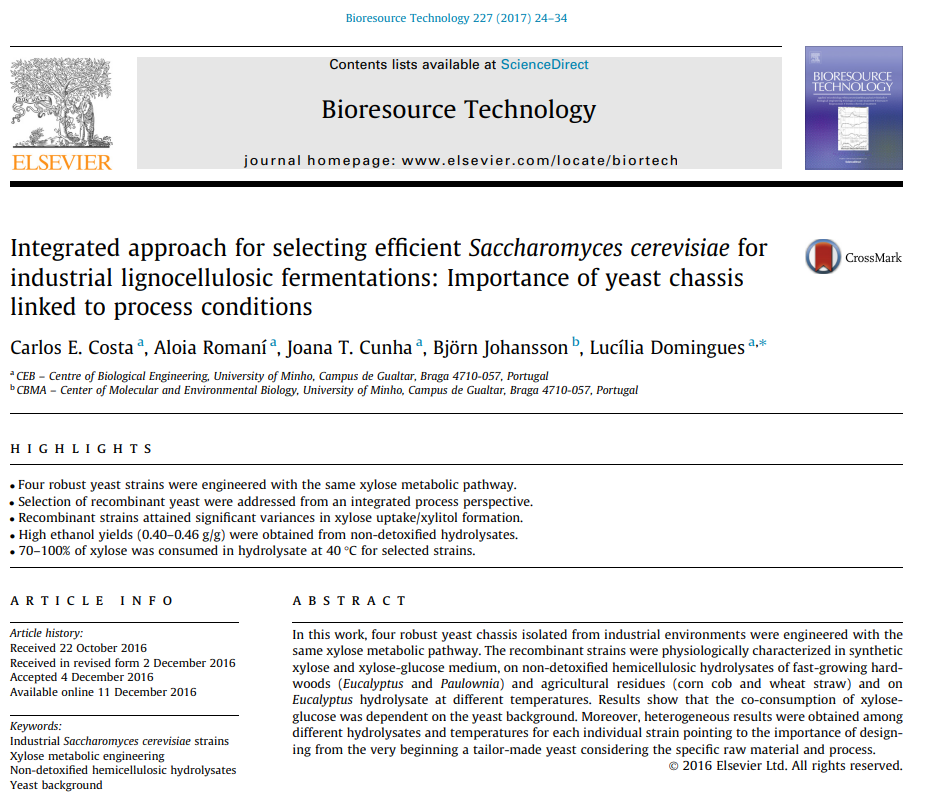
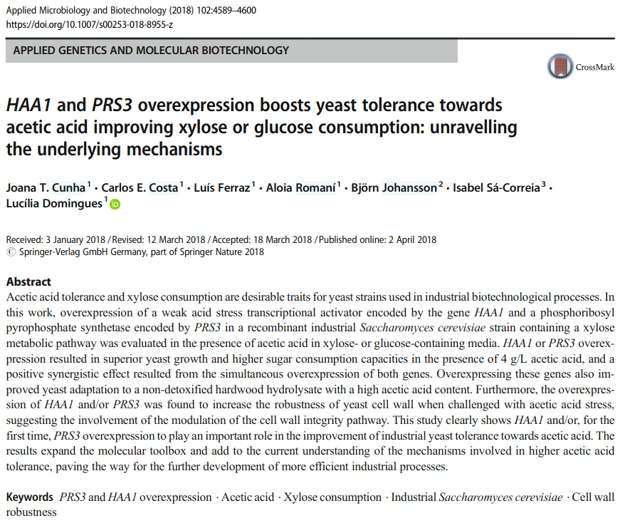

# Cunha et al. 2017

This repository contains Jupyter notebooks and sequence files describing the construction of recombinant metabolic pathways 
for _Saccharomyces cerevisiae_ using [python](https://www.python.org/) and [pydna](https://github.com/pydna-group/pydna).

The notebooks and sequence files are located in the `notebooks` subfolder and have files extensions `.ipynb` and `.gb`, respectively. 
Both file types can be viewed in the browser directly.

Each notebook contain links (usually in the end) to the resulting sequences in Genbank flat file format.

Romaní, A., Pereira, F., Johansson, B., & Domingues, L. (2015). Metabolic engineering of Saccharomyces cerevisiae ethanol strains PE-2 and CAT-1 for efficient lignocellulosic fermentation. Bioresour. Technol., 179, 150–158. https://doi.org/10.1016/j.biortech.2014.12.020

- [pMEC1049](notebooks/pMEC1049.ipynb)

The pMEC1049 pathway is also used in Costa 2017 et al.

Costa, C. E., Romaní, A., Cunha, J. T., Johansson, B., & Domingues, L. (2017). Integrated approach for selecting efficient Saccharomyces cerevisiae for industrial lignocellulosic fermentations: Importance of yeast chassis linked to process conditions. Bioresour. Technol., 227, 24–34. https://doi.org/10.1016/j.biortech.2016.12.016

***

Cunha, J. T., Costa, C. E., Ferraz, L., Romaní, A., Johansson, B., Sá-Correia, I., & Domingues, L. (2018). HAA1 and PRS3 overexpression boosts yeast tolerance towards acetic acid improving xylose or glucose consumption: Unravelling the underlying mechanisms. Appl. Microbiol. Biotechnol., 102(10), 4589–4600. https://doi.org/10.1007/s00253-018-8955-z

- [pMEC9001-2-3](notebooks/pMEC9001-2-3.ipynb)

***

This repository is called "Cunha.." while "Costa.." would have been the a better designation. 
This repository was first committed to on Jan 30, 2017 before the final author order was decided.

These notebooks are tested using a github action. This means that the notebook outputs are executed and results 
compared with previously saved results. If the badge below is green, all tests gave the expected results.

If you would like to have your own copy of this repository, the best solution is to get a
Github account and then make your own fork. If you would like to download all files to your
computer as a zip file, Click [here](https://github.com/BjornFJohansson/Cunha_et_al_2017/archive/master.zip)
